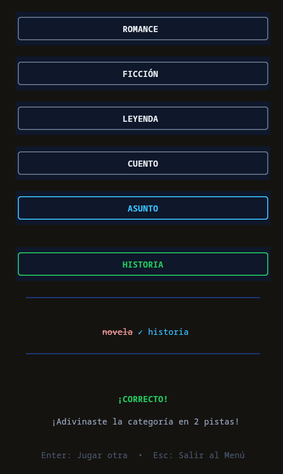

# Procesamiento de Lenguaje Natural

# Equipo
Maria Renata Borreguin Ortega
Daniel Alberto Herrera Muñoz
Eliberto Gutierrez Marin
Ryou Ferdinand Hau Matsuura

# Introducción
Este proyecto es una recreacion inspirada en el juego "Pinpoint" de LinkedIn. El objetivo del juego es que el jugador identifique la categoría del conjunto de palabras que se dan como pistas. Este proyecto integra el *Procesamiento de Lenguaje Natural* para generar pistas de manera dinámica y evaluar las respuestas de los usuarios mediante análisis semántico.

# Mecánicas del juego

Entre las características que implementamos, las mas notables son el sistema de dificultad, el cual ajusta las pistas dependiendo del selector de dificultad (1 siendo el mas dificil y 5 el mas facil). Y la validacion flexible de las respuestas para que el juego permita variaciones morfológicas de las palabras que escriba el usuario para evitar la frustración al no tener que escribir la variacion de la palabra exacta.

Para la lógica interna del juego, utilizamos las librerías de nltk, wordnet, spacy y wordfreq.

# WordNet

El juego consulta la base de datos léxica de WordNet para extraer relaciones semánticas precisas:

Hipónimos: Se extraen términos más específicos que se derivan del concepto principal (subcategorías).

Hiperónimos: Se extraen términos más generales que engloban a la palabra objetivo (supercategorías).

Esta jerarquía hace que las pistas que se le otorgan al jugador mantengan una cohesión lógica .

# SpaCy

Para la evaluación de los candidatos a respuesta que escribe el jugador, utilizamos la lematizacion avanzada utilizando spaCy.
Al procesar el input, spaCy realiza un análisis morfológico que reduce las palabras a su lema. Esto garantiza que las conjugaciones funcionen y sean detectadas como la respuesta correcta.

# Dificultad
Respecto a la dificultad, el nivel de dificultad indica que tan “rebuscadas” son las pistas que se le daran al jugador, esto se mide por medio de zipf_frequency. El nivel de dificultad es solo un filtro, el cual hace que solo aparezcan las palabras que tengan una frecuencia de zipf mayor al nivel de dificultad, y ya despues se hace el ordenamiento de las pistas, de la menos a mas frecuente.

# Idiomas
El juego está configurado para jugar tanto con español como ingles. Para asegurar que todo funcione correctamente en español en la lematización, se utiliza el modelo de lennguaje es_core_news_md de spaCy.

# Para correrlo necesitas 
Para correr el juego se necesita:

bun, python3, nltk, spacy, wordfreq

y ejecutar:
python -m spacy download es_core_news_md

# Ejecutas con 
bun run src/main.tsx

